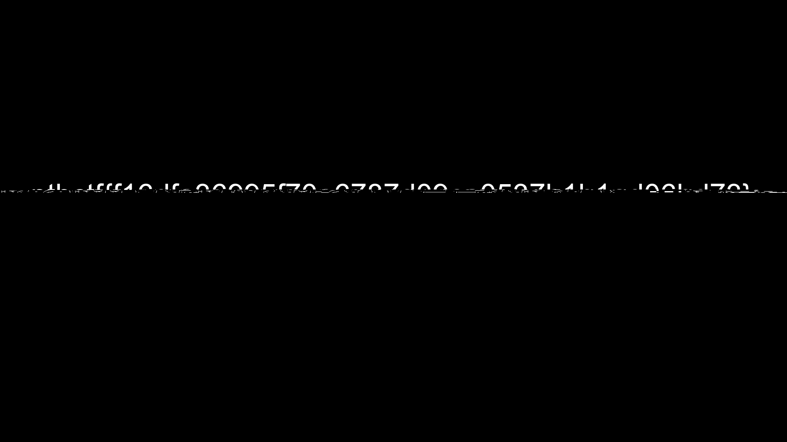
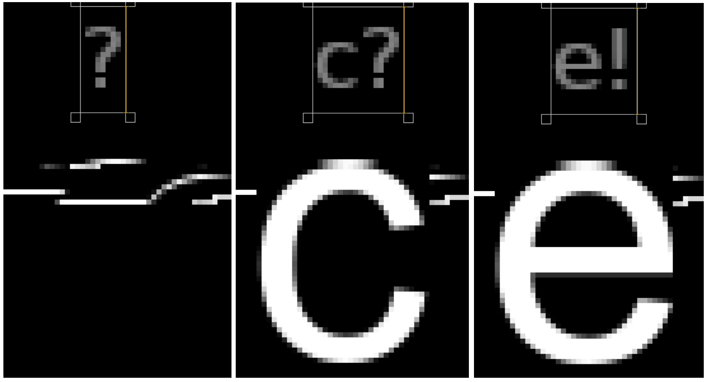

## Coding/Forensics - Malus Starkrimson

A very simple check showed that image contains just one partition:

```
$ file malus.dmg
malus.dmg: DOS/MBR boot sector; partition 1 : ID=0xee, start-CHS (0x3ff,254,63), end-CHS (0x3ff,254,63), startsector 1, 1023999 sectors, extended partition table (last)

$ sgdisk -O malus.dmg

Disk size is 1024000 sectors (500.0 MiB)
MBR disk identifier: 0x00000000
MBR partitions:

Number  Boot  Start Sector   End Sector   Status      Code
   1                     1      1023999   primary     0xEE

$ sgdisk -p malus.dmg
Disk malus.dmg: 1024000 sectors, 500.0 MiB
Sector size (logical): 512 bytes
Disk identifier (GUID): AFCC2E7D-DD83-4E63-B4E9-479DAD60EF7B
Partition table holds up to 128 entries
Main partition table begins at sector 2 and ends at sector 33
First usable sector is 34, last usable sector is 1023966
Partitions will be aligned on 8-sector boundaries
Total free space is 13 sectors (6.5 KiB)

Number  Start (sector)    End (sector)  Size       Code  Name
   1              40         1023959   500.0 MiB   AF0A  disk image
```

From the challenge description it was clear that partition contains APFS, so I
googled a bit and found [apfs-fuse](https://github.com/sgan81/apfs-fuse), which
is able to r/o mount APFS and also provides some nice tools to dump internal
structures in human-readable-ish form.

As a first step, I tried to mount it and look at its contents:

```
# losetup --show -rf ./malus.dmg
/dev/loop0

# kpartx -av /dev/loop0
add map loop0p1 (253:5): 0 1023920 linear 7:0 40

# apfs-fuse /dev/mapper/loop0p1 /mnt/apfs

$ find /mnt/apfs -type f | wc -l
10005
```

It contained 10000 PNG files and few gzip-compressed `fseventsd` logs.
I suspected that either one of these PNG files or some deleted file
contains the flag. I tried to use
[photorec](https://www.cgsecurity.org/wiki/PhotoRec), but it was only able to
"recover" the same 10000 of PNG files, plus some additional `fseventsd` logs.

"Let's try to dig into fseventsd", I thought next. It appears that format of
these log files
[is very simple and already known](http://nicoleibrahim.com/apple-fsevents-forensics/),
so I wrote my own parser: [fsevents-parser.py](./fsevents-parser.py).

When examining `root/.fseventsd/000000000011d647` (not even deleted or somehow
hidden), I found one suspicious file:

```
fname:  file6301.png
    event id:  1124313
    reason:  8388885
         Item is File
         Permissions Changed
         Created
         Inode Metadata Modified
         Content Modified
    node id:  5038
```

Entries of other files looked like this:

```
...
fname:  file6302.png
    event id:  1124319
    reason:  8388625
         Item is File
         Created
         Content Modified
    node id:  6320
fname:  file6303.png
    event id:  1124325
    reason:  8388625
         Item is File
         Created
         Content Modified
    node id:  6321
fname:  file6304.png
    event id:  1124331
    reason:  8388625
         Item is File
         Created
         Content Modified
    node id:  6322
...
```

Clearly, `file6301.png` is somehow special. I tried to submit hex string
displayed in this PNG in various formats, adding [0-9a-f] at the end (because
image looked cropped at right side), various attributes of this file, etc.
Obviously, without any luck.
(yes, I should read the rules carefully next time)

After unsuccessful abusing of the flag submission form, I decided to try other
tools. `apfs-dump` from `apfs-fuse` was the first one. Again, it showed that
`file6301.png` differs from other PNGs:

```
$ grep "Ino.*file6301.png" apfs-dump.out.txt
Inode    13AE => 2 13AE [TS] 8000 [INODE_NO_RSRC_FORK] 1 0 4 0 [] 99 99 100644 0 0 XF: 2 38 : 04 02 000D : 08 20 0028 : [NAME] 'file6301.png' : [DSTREAM] 3816 4000 0 7478 78C4  [INODE_NO_RSRC_FORK]
Inode    13AE => 2 13AE [TS] 8000 [INODE_NO_RSRC_FORK] 1 0 4 0 [] 99 99 100644 0 0 XF: 2 38 : 04 02 000D : 08 20 0028 : [NAME] 'file6301.png' : [DSTREAM] 3816 4000 0 7478 3CA0E  [INODE_NO_RSRC_FORK]

$ grep "Ino.*file6302.png" apfs-dump.out.txt
Inode    18B0 => 2 18B0 [TS] 8000 [INODE_NO_RSRC_FORK] 1 0 2 0 [] 99 99 100644 0 0 XF: 2 38 : 04 02 000D : 08 20 0028 : [NAME] 'file6302.png' : [DSTREAM] 35FE 4000 0 35FE 0  [INODE_NO_RSRC_FORK]

$ grep "Ino.*file6303.png" apfs-dump.out.txt
Inode    18B1 => 2 18B1 [TS] 8000 [INODE_NO_RSRC_FORK] 1 0 2 0 [] 99 99 100644 0 0 XF: 2 38 : 04 02 000D : 08 20 0028 : [NAME] 'file6303.png' : [DSTREAM] 386A 4000 0 386A 0  [INODE_NO_RSRC_FORK]

$ grep "Ino.*file6304.png" apfs-dump.out.txt
Inode    18B2 => 2 18B2 [TS] 8000 [INODE_NO_RSRC_FORK] 1 0 2 0 [] 99 99 100644 0 0 XF: 2 38 : 04 02 000D : 08 20 0028 : [NAME] 'file6304.png' : [DSTREAM] 3505 4000 0 3505 0  [INODE_NO_RSRC_FORK]
```

Note the last part of each line, after `[DSTREAM]`. The
[format](https://github.com/sgan81/apfs-fuse/blob/670e45ef92996f604fd6cd9a0b56d84fc6c3df51/ApfsLib/BlockDumper.cpp#L1270)
is: `<size> <alloced_size> <default_crypto_id> <total_bytes_written> <total_bytes_read>`.
I do not know what is the point of keeping `total_bytes_written` and
`total_bytes_read` (maybe for some FS usage statistics?), but these numbers gave
me idea that

* data in this file was probably overwritten (`total_bytes_written > size`),
* size of original data is 15458 bytes (`0x7478 - 0x3816`) and
* it was read (?).

So, if data was overwritten, maybe some remains are still there. But where
exactly? Now I know that all information was already there - in the `apfs-dump`
output. But during the competition, I decided to try another tool: [fork of The
Sleuth Kit](https://github.com/blackbagtech/sleuthkit-APFS) (with APFS support).
After figuring out that inode number of `file6301.png` notably differs from
its neighbours, I did this:

```
$ fls -l -B 53572 /dev/mapper/loop0p1 | sort -nk2 | grep -C 3 "file6301.png"
r/r 5035:       file5018.png    2019-08-13 19:07:07 (+05)       2019-08-13 19:07:07 (+05)       2019-08-13 19:07:07 (+05)       2019-08-13 19:07:07 (+05)       13341   99      99
r/r 5036:       file5019.png    2019-08-13 19:07:08 (+05)       2019-08-13 19:07:07 (+05)       2019-08-13 19:07:08 (+05)       2019-08-13 19:07:07 (+05)       13401   99      99
r/r 5037:       file5020.png    2019-08-13 19:07:08 (+05)       2019-08-13 19:07:08 (+05)       2019-08-13 19:07:08 (+05)       2019-08-13 19:07:08 (+05)       14694   99      99
r/r 5038:       file6301.png    2019-08-13 19:12:23 (+05)       2019-08-13 19:36:28 (+05)       2019-08-13 19:12:23 (+05)       2019-08-13 19:07:08 (+05)       14358   99      99
r/r 5039:       file5021.png    2019-08-13 19:07:08 (+05)       2019-08-13 19:07:08 (+05)       2019-08-13 19:07:08 (+05)       2019-08-13 19:07:08 (+05)       14964   99      99
r/r 5040:       file5022.png    2019-08-13 19:07:08 (+05)       2019-08-13 19:07:08 (+05)       2019-08-13 19:07:08 (+05)       2019-08-13 19:07:08 (+05)       31203   99      99
r/r 5041:       file5023.png    2019-08-13 19:07:09 (+05)       2019-08-13 19:07:08 (+05)       2019-08-13 19:07:09 (+05)       2019-08-13 19:07:08 (+05)       30370   99      99
```

Yes, it was created much earlier than its by-name neighbours! And if APFS
allocates blocks for data sequentially when files are written sequentially
one at a time, then some parts of original data may be still there - between
`file5020.png` and `file5021.png`. Now it's time of the hex editor!

In the range `0x065ea966 - 0x065eefff` I found something looking like the PNG
file, but in the reverse order: `IEND` chunk first, and `PNG.*IHDR` after it.
With usual "garbage" and zeros in between.

After gluing both parts together in the right order, I've got file of size 15458
(which is expected size of the original data of `file6301.png`). Actual PNG data
was still corrupted, but GIMP was able to decode the top half of image:



The flag is here! Text obviously begins with `ptbctf{` and ends with `}`. Some
digits are quite readable: `1`, `5`, `7`, `b`, `d`, `f`. Others are tricky,
especially `a`, `c` and `e`, because we have only one-pixel top line remaining
of them.

But we also have a lot of other not garbled PNGs with random text printed using
the same font. And so, we may try to manually compare pixels from
corrupted original `file6301.png` with digits from other PNGs used as a
reference. In fact, even one-pixel line is enough to distinguish between
different digits (800% zoom in GIMP):



Difference between top line of pixels of `c` and `e` is clearly visible, at
least on my display. However, this may require additional steps - adjusting
contrast of images and maybe playing with some curves.

Final result is [here](./manual-decoding.xcf).
